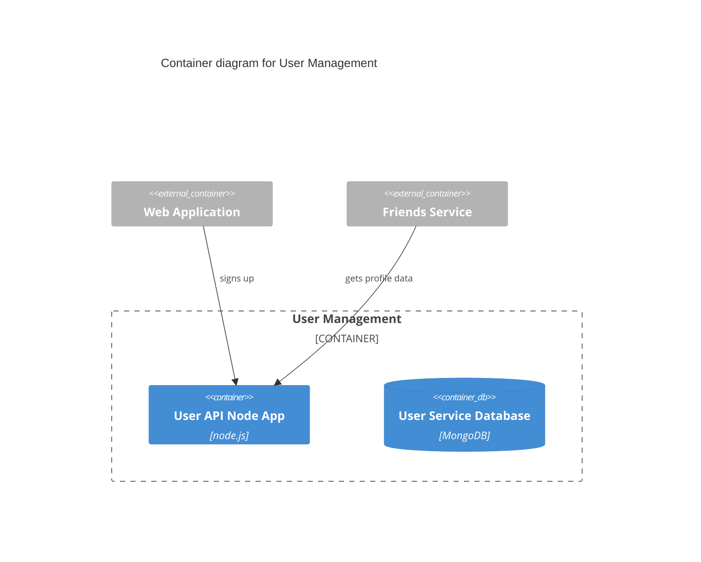

# user-spec
API Spec for User Service

## Tech Stack

The User service will be implemented using the MERN stack.

## C4 Container Diagram

```mermaid
C4Container
title Container diagram for User Management

Container_Boundary(userservice, "User Management") {
    Container(nodeapp, "User API Node App","node.js")
    ContainerDb(usersdb, "User Service Database", "MongoDB")
}

Container_Ext(webapp,"Web Application")
Container_Ext(friendsservice,"Friends Service")

Rel(webapp, nodeapp, "signs up")
Rel(friendsservice, nodeapp, "gets profile data")

UpdateRelStyle(webapp, nodeapp, $offsetY="-40")
UpdateRelStyle(friendsservice, nodeapp, $offsetY="-40")
```
